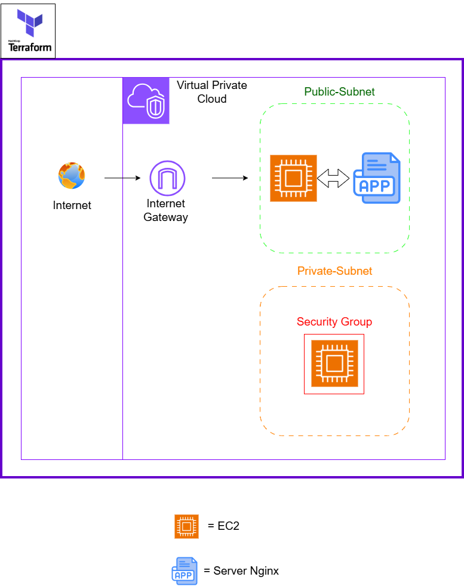

# VPC AWS Sécurisée avec Terraform

Ce projet crée une **infrastructure réseau AWS sécurisée** avec Terraform.  
Il comprend un **VPC**, des **subnets publics et privés**, une **instance EC2 avec Nginx**, un **Internet Gateway** et des **Security Groups** pour sécuriser l’accès.

---

## Architecture

- **VPC** : réseau principal  
- **Subnet Public** : héberge EC2 / Nginx, accessible depuis Internet  
- **Subnet Privé** : DB isolées 
- **Internet Gateway (IGW)** : connecte le subnet public à Internet  
- **Route Tables** : gèrent le routage entre subnets et IGW  
- **Security Groups** : contrôle des accès réseau (SSH, HTTP, etc.)

---

## Diagramme de l’Architecture

Voici l’architecture de notre VPC avec EC2 et subnets privés :

- **Subnet Public** : EC2 + Nginx accessible depuis Internet  
- **Subnet Privé** : Réseau isolées pour base de donnée
- **Internet Gateway (IGW)** : permet la communication du subnet public avec Internet  
- **Security Groups** : contrôle l’accès réseau  



---

## Technologies

- **AWS** (Amazon Web Services)  
- **Terraform** (Infrastructure as Code)  
- **Git** (Gestion de version)  

---

## Instructions pour déployer l’infrastructure

1. Cloner le repository :

```bash
git clone https://github.com/HarounaCamara007/aws-secure-vpc-terraform.git
cd aws-secure-vpc-terraform